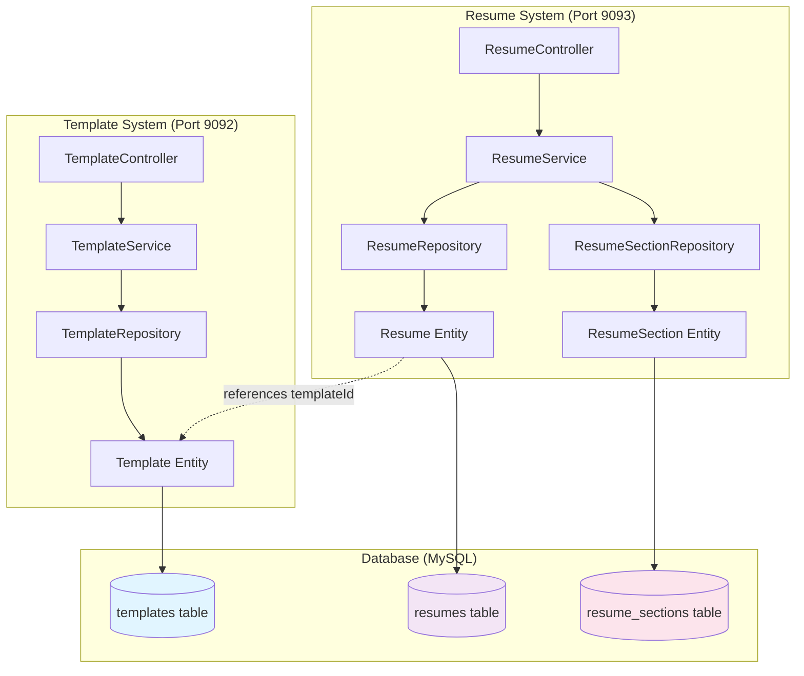
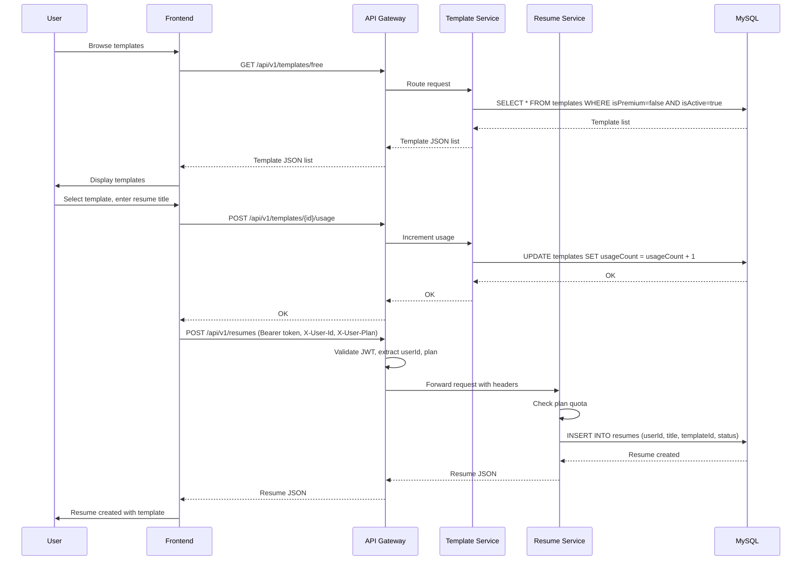

# Resume & Template Storage Process Guide

This document explains how the resume and template systems work together, including database storage, relationships, and the complete workflow from template selection to resume creation.

## Architecture Overview



## Template Service

The template service manages resume templates that serve as visual blueprints for resumes.

### Database Schema: Template Entity

[Backend/template-service/src/main/java/com/resumade/template/entity/Template.java](Backend/template-service/src/main/java/com/resumade/template/entity/Template.java)

Purpose: Stores template styling and layout configuration.

**Key fields:**
- `templateId` (PK): Auto-generated unique identifier.
- `name`: Template name (e.g., "Professional Classic").
- `description`: User-facing description.
- `htmlLayout`: HTML template with `{{content}}` placeholder.
- `cssStyles`: CSS styling for the template.
- `layoutConfig`: JSON string defining section order, fonts, colors, and styling (up to 50KB per template).
- `category`: Enum (PROFESSIONAL, CREATIVE, MODERN, MINIMALIST, ATS_OPTIMISED).
- `isPremium`: Boolean flag for paid-only templates.
- `isActive`: Soft delete flag; deactivated templates don't appear in listings.
- `usageCount`: Tracks how many resumes use this template.
- `colorScheme`, `fontFamily`, `layout`: Metadata for filtering and preview.
- `hasPhoto`, `hasSkillBars`: Feature flags.
- `previewData`: JSON string for live editor preview.
- `createdAt`: Timestamp.

### Template Seeding

[Backend/template-service/src/main/java/com/resumade/template/TemplateServiceApplication.java](Backend/template-service/src/main/java/com/resumade/template/TemplateServiceApplication.java)

On startup, if no templates exist, the application seeds three default templates:
1. **Classic Professional**: Professional category, free, uses `CLASSIC_PROFESSIONAL_CONFIG`.
2. **Modern Minimal**: Minimalist category, free, uses `MODERN_MINIMAL_CONFIG`.
3. **Two-Column Executive**: Professional category, free, uses `TWO_COLUMN_EXECUTIVE_CONFIG`.

Each template includes hardcoded layout configuration with:
- Font families and sizes for headings, body, mono.
- Accent colors and divider styling.
- Section definitions (SUMMARY, EXPERIENCE, EDUCATION, SKILLS, LANGUAGES).
- Rendering directives (e.g., skills as tags vs. inline).

**Code block** in TemplateServiceApplication:
```java
@Bean
public CommandLineRunner loadData(TemplateRepository repository) {
    return args -> {
        if (repository.count() == 0) {
            // Creates 3 default templates with hardcoded layout configs
            Template pro = new Template("Professional Classic", ...);
            Template creative = new Template("Creative Studio", ...);
            Template modern = new Template("Modern Tech", ...);
            repository.save(pro);
            repository.save(creative);
            repository.save(modern);
        }
    };
}
```

### Template Service Implementation

[Backend/template-service/src/main/java/com/resumade/template/service/TemplateServiceImpl.java](Backend/template-service/src/main/java/com/resumade/template/service/TemplateServiceImpl.java)

**Main methods:**

- **getAllActiveTemplates()**: Returns all templates where `isActive = true`.
- **getFreeTemplates()**: Returns active templates where `isPremium = false`.
- **getPremiumTemplates()**: Returns active templates where `isPremium = true`.
- **getTemplatesByCategory(category)**: Filters by category enum.
- **getPopularTemplates()**: Orders by `usageCount` descending.
- **getTemplateById(id)**: Single template lookup.
- **createTemplate(request, role)**: Admin-only endpoint; validates role, normalizes HTML/CSS, saves template.
- **updateTemplate(id, request, role)**: Admin-only; updates all editable fields including layout config.
- **deactivateTemplate(id, role)**: Soft delete by setting `isActive = false`.
- **incrementUsage(id)**: Increments usage count when a resume is created with this template.

**Code block** for incrementing usage:
```java
@Override
@Transactional
public void incrementUsage(Integer id) {
    Template template = getTemplateById(id);
    template.setUsageCount(template.getUsageCount() + 1);
    templateRepository.save(template);
}
```

### Template Controller

[Backend/template-service/src/main/java/com/resumade/template/controller/TemplateController.java](Backend/template-service/src/main/java/com/resumade/template/controller/TemplateController.java)

**Public endpoints** (no auth required, but public path filters apply):
- `GET /api/v1/templates`: All active templates.
- `GET /api/v1/templates/free`: Free templates only.
- `GET /api/v1/templates/premium`: Premium templates only.
- `GET /api/v1/templates/category/{category}`: Templates by category.
- `GET /api/v1/templates/popular`: Top templates by usage.
- `GET /api/v1/templates/{id}`: Single template details.
- `POST /api/v1/templates/{id}/usage`: Increment usage count (called by resume-service).

**Admin endpoints** (requires ADMIN role in X-User-Role header):
- `POST /api/v1/templates`: Create new template.
- `PUT /api/v1/templates/{id}`: Update existing template.
- `DELETE /api/v1/templates/{id}`: Deactivate template.

**Code block** for usage increment endpoint:
```java
@Operation(summary = "Increment usage count for a template")
@PostMapping("/{id}/usage")
public ResponseEntity<Void> incrementUsage(@PathVariable("id") Integer id) {
    templateService.incrementUsage(id);
    return ResponseEntity.ok().build();
}
```

### Template Repository

[Backend/template-service/src/main/java/com/resumade/template/repository/TemplateRepository.java](Backend/template-service/src/main/java/com/resumade/template/repository/TemplateRepository.java)

Query helpers:
- `findByIsActiveTrue()`: All active templates.
- `findByIsActiveTrueAndIsPremiumFalse()`: Active free templates.
- `findByIsActiveTrueAndIsPremiumTrue()`: Active premium templates.
- `findByIsActiveTrueAndCategory(category)`: Filtered by category.
- `findByIsActiveTrueOrderByUsageCountDesc()`: Popular templates.

## Resume Service

The resume service manages user resumes, linking them to templates and storing sections.

### Database Schema: Resume Entity

[Backend/resume-service/src/main/java/com/resumade/resume/entity/Resume.java](Backend/resume-service/src/main/java/com/resumade/resume/entity/Resume.java)

Purpose: Stores user resume metadata and references the template.

**Key fields:**
- `resumeId` (PK): Auto-generated unique identifier.
- `userId` (FK): References the user who owns the resume.
- `title`: User-provided resume title (e.g., "Software Engineer Resume").
- `targetJobTitle`: Optional target job for the resume.
- `templateId` (FK): References the template used. **This is the link to templates table.**
- `atsScore`: Latest ATS compatibility score (initially 0).
- `status`: Enum (DRAFT, COMPLETE, PUBLISHED).
- `language`: Resume language, default "en".
- `isPublic`: Boolean; public resumes appear in gallery.
- `viewCount`: Counter for public resume views.
- `ownerName`, `ownerAvatar`: Public profile info for gallery display.
- `sections`: One-to-many relationship with ResumeSection entities.
- `createdAt`, `updatedAt`: Timestamps.

**Code block** showing template linkage:
```java
@Column(nullable = false)
private Integer templateId;

// The Resume holds a one-to-many relationship with sections
@OneToMany(mappedBy = "resume", cascade = CascadeType.ALL, orphanRemoval = true)
@OrderBy("displayOrder ASC")
private List<ResumeSection> sections = new ArrayList<>();
```

### Database Schema: ResumeSection Entity

[Backend/resume-service/src/main/java/com/resumade/resume/entity/ResumeSection.java](Backend/resume-service/src/main/java/com/resumade/resume/entity/ResumeSection.java)

Purpose: Stores individual sections within a resume.

**Key fields:**
- `sectionId` (PK): Auto-generated unique identifier.
- `resumeId` (FK): References the parent Resume.
- `sectionType`: Enum (PERSONAL_INFO, SUMMARY, EXPERIENCE, EDUCATION, SKILLS, PROJECTS, CERTIFICATIONS, CUSTOM, ACHIEVEMENTS).
- `title`: Section title (e.g., "Work Experience").
- `content`: JSON string storing section data; format depends on section type.
- `displayOrder`: Numeric order for rendering sections (1, 2, 3, ...).
- `isVisible`: Boolean; hidden sections don't appear on export/print.
- `aiGenerated`: Boolean; tracks if content was AI-generated.
- `createdAt`: Timestamp.

**Code block** showing resume relationship:
```java
@ManyToOne(fetch = FetchType.LAZY)
@JoinColumn(name = "resume_id", nullable = false)
@JsonIgnore
private Resume resume;

@Enumerated(EnumType.STRING)
@Column(nullable = false)
private SectionType sectionType;

@Column(columnDefinition = "TEXT")
private String content; // Stored as JSON string depending on type

@Column(nullable = false)
private Integer displayOrder;
```

### Resume Service Implementation

[Backend/resume-service/src/main/java/com/resumade/resume/service/ResumeServiceImpl.java](Backend/resume-service/src/main/java/com/resumade/resume/service/ResumeServiceImpl.java)

**Main methods:**

- **createResume(userId, plan, request)**: 
  - Enforces plan quota: FREE users max 3 resumes, PREMIUM unlimited.
  - Creates a new Resume with templateId from request.
  - Saves to database; returns the resume object.

  **Code block:**
  ```java
  @Override
  @Transactional
  public Resume createResume(Integer userId, String plan, ResumeRequest request) {
      // Enforce quota limits
      if ("FREE".equalsIgnoreCase(plan)) {
          long count = resumeRepository.countByUserId(userId);
          if (count >= 3) {
              throw new QuotaExceededException("Free plan users can only create 3 resumes.");
          }
      }
      
      Resume resume = new Resume(userId, request.getTitle(), 
                                 request.getTargetJobTitle(), 
                                 request.getTemplateId());
      return resumeRepository.save(resume);
  }
  ```

- **getResumeById(resumeId, userId)**: 
  - Checks authorization: owner or public resume.
  - Increments view count if accessed by non-owner on public resume.

- **updateResume(resumeId, userId, request)**: 
  - Updates title, targetJobTitle, templateId.
  - Verifies ownership.

- **deleteResume(resumeId, userId)**: 
  - Removes resume and all sections (cascade delete).

- **duplicateResume(resumeId, userId, plan)**: 
  - Creates a copy of an existing resume.
  - Copies all sections with new display order.
  - Enforces plan quota.

  **Code block** for section duplication:
  ```java
  Resume savedCopy = resumeRepository.save(copy);
  
  for (ResumeSection section : original.getSections()) {
      ResumeSection sectionCopy = new ResumeSection(
          savedCopy, 
          section.getSectionType(),
          section.getTitle(),
          section.getContent(),
          section.getDisplayOrder()
      );
      sectionCopy.setIsVisible(section.getIsVisible());
      sectionRepository.save(sectionCopy);
  }
  ```

- **publishResume(resumeId, userId, isPublic, ownerName, ownerAvatar)**: 
  - Sets isPublic flag and updates status.
  - Stores public identity info.

- **addSection(resumeId, userId, sectionRequest)**: 
  - Creates a new section within a resume.
  - Assigns displayOrder.

  **Code block:**
  ```java
  @Override
  @Transactional
  public ResumeSection addSection(Integer resumeId, Integer userId, SectionRequest request) {
      Resume resume = getResumeForUser(resumeId, userId);
      ResumeSection section = new ResumeSection(
          resume,
          request.getSectionType(),
          request.getTitle(),
          request.getContent(),
          request.getDisplayOrder() != null ? request.getDisplayOrder() : resume.getSections().size()
      );
      return sectionRepository.save(section);
  }
  ```

- **updateSection(sectionId, userId, sectionRequest)**: 
  - Verifies ownership via resume → userId.
  - Updates title and content.

- **deleteSection(sectionId, userId)**: 
  - Removes a section; orphanRemoval cascades deletion.

- **reorderSections(resumeId, userId, reorderRequests)**: 
  - Updates displayOrder for multiple sections.

  **Code block:**
  ```java
  @Override
  @Transactional
  public void reorderSections(Integer resumeId, Integer userId, List<SectionOrderRequest> reorderRequests) {
      Resume resume = getResumeForUser(resumeId, userId);
      
      for (SectionOrderRequest orderReq : reorderRequests) {
          sectionRepository.updateSectionOrder(orderReq.getSectionId(), orderReq.getOrder());
      }
  }
  ```

- **toggleSectionVisibility(sectionId, userId, isVisible)**: 
  - Hides/shows sections for export.

### Resume Controller

[Backend/resume-service/src/main/java/com/resumade/resume/controller/ResumeController.java](Backend/resume-service/src/main/java/com/resumade/resume/controller/ResumeController.java)

**Endpoints:**
- `POST /api/v1/resumes`: Create resume (requires auth, X-User-Id, X-User-Plan headers).
- `GET /api/v1/resumes`: List user's resumes.
- `GET /api/v1/resumes/{id}`: Get single resume (allows public access).
- `PUT /api/v1/resumes/{id}`: Update resume.
- `DELETE /api/v1/resumes/{id}`: Delete resume.
- `POST /api/v1/resumes/{id}/duplicate`: Duplicate resume.
- `PUT /api/v1/resumes/{id}/publish`: Publish/unpublish resume.
- `GET /api/v1/resumes/public`: Get public gallery resumes (optional search).

**Code block** for resume creation endpoint:
```java
@PostMapping
public ResponseEntity<Resume> createResume(
    @RequestHeader("X-User-Id") Integer userId,
    @RequestHeader(value = "X-User-Plan", defaultValue = "FREE") String plan,
    @Valid @RequestBody ResumeRequest request) {
    Resume created = resumeService.createResume(userId, plan, request);
    return ResponseEntity.status(HttpStatus.CREATED).body(created);
}
```

### Section Controller

[Backend/resume-service/src/main/java/com/resumade/resume/controller/SectionController.java](Backend/resume-service/src/main/java/com/resumade/resume/controller/SectionController.java)

**Endpoints:**
- `POST /api/v1/sections/resume/{resumeId}`: Add section to resume.
- `PUT /api/v1/sections/{id}`: Update section.
- `DELETE /api/v1/sections/{id}`: Delete section.
- `PUT /api/v1/sections/resume/{resumeId}/reorder`: Reorder sections.
- `PATCH /api/v1/sections/{id}/visibility`: Toggle visibility.

### Repositories

[Backend/resume-service/src/main/java/com/resumade/resume/repository/ResumeRepository.java](Backend/resume-service/src/main/java/com/resumade/resume/repository/ResumeRepository.java)

Query helpers:
- `findByUserId(userId)`: All resumes for a user.
- `findByUserIdOrderByUpdatedAtDesc(userId)`: Most recently updated first.
- `findByIsPublicTrueOrderByViewCountDesc()`: Popular public resumes.
- `searchPublicResumes(q)`: Full-text search on title, target job, owner name.
- `countByUserId(userId)`: For quota enforcement.

[Backend/resume-service/src/main/java/com/resumade/resume/repository/ResumeSectionRepository.java](Backend/resume-service/src/main/java/com/resumade/resume/repository/ResumeSectionRepository.java)

Query helpers:
- `findByResumeResumeIdOrderByDisplayOrderAsc(resumeId)`: Sections in order.
- `updateSectionOrder(sectionId, order)`: Bulk update display order.

## Complete Flow: Template Selection → Resume Creation



## DTOs (Data Transfer Objects)

### ResumeRequest

[Backend/resume-service/src/main/java/com/resumade/resume/dto/ResumeRequest.java](Backend/resume-service/src/main/java/com/resumade/resume/dto/ResumeRequest.java)

Used for creating/updating resumes:
- `title` (required): Resume title.
- `targetJobTitle` (optional): Job title being targeted.
- `templateId` (required): Template ID to use.

### SectionRequest

[Backend/resume-service/src/main/java/com/resumade/resume/dto/SectionRequest.java](Backend/resume-service/src/main/java/com/resumade/resume/dto/SectionRequest.java)

Used for adding/updating sections:
- `sectionType` (required): Enum value (EXPERIENCE, EDUCATION, etc.).
- `title` (required): Section title.
- `content` (optional): Section content (JSON format depends on type).
- `displayOrder` (optional): Order in resume; auto-assigned if not provided.

### SectionOrderRequest

[Backend/resume-service/src/main/java/com/resumade/resume/dto/SectionOrderRequest.java](Backend/resume-service/src/main/java/com/resumade/resume/dto/SectionOrderRequest.java)

Used for reordering sections:
- `sectionId` (required): Section ID.
- `order` (required): New display order.

### TemplateRequest

[Backend/template-service/src/main/java/com/resumade/template/dto/TemplateRequest.java](Backend/template-service/src/main/java/com/resumade/template/dto/TemplateRequest.java)

Used for creating/updating templates (admin only):
- `name` (required): Template name.
- `description`: Description.
- `thumbnailUrl`: Image URL for preview.
- `htmlLayout` (required): HTML template with `{{content}}` placeholder.
- `cssStyles` (required): CSS styling.
- `category`: Enum (PROFESSIONAL, CREATIVE, MODERN, MINIMALIST, ATS_OPTIMISED).
- `isPremium`: Premium flag.
- `isActive`: Active flag.
- `layoutConfig`: Large JSON config with detailed styling.
- Aesthetic metadata: colorScheme, fontFamily, layout, hasPhoto, hasSkillBars, previewData.

## Database Tables (MySQL)

### templates table
```
+-----------------+----------+----------+
| Column          | Type     | Notes    |
+-----------------+----------+----------+
| template_id     | INT      | PK       |
| name            | VARCHAR  | Not null |
| description     | TEXT     |          |
| thumbnail_url   | VARCHAR  |          |
| html_layout     | TEXT     | Not null |
| css_styles      | TEXT     | Not null |
| category        | ENUM     | Not null |
| is_premium      | BOOLEAN  | Not null |
| is_active       | BOOLEAN  | Not null |
| usage_count     | INT      | Default 0|
| color_scheme    | VARCHAR  |          |
| font_family     | VARCHAR  |          |
| layout          | VARCHAR  |          |
| has_photo       | BOOLEAN  |          |
| has_skill_bars  | BOOLEAN  |          |
| preview_data    | TEXT     |          |
| layout_config   | LONGTEXT |          |
| created_at      | TIMESTAMP| Not null |
+-----------------+----------+----------+
```

### resumes table
```
+-----------------+----------+----------+
| Column          | Type     | Notes    |
+-----------------+----------+----------+
| resume_id       | INT      | PK       |
| user_id         | INT      | FK       |
| title           | VARCHAR  | Not null |
| target_job_title| VARCHAR  |          |
| template_id     | INT      | FK       |
| ats_score       | INT      | Default 0|
| status          | ENUM     | DRAFT... |
| language        | VARCHAR  | en       |
| is_public       | BOOLEAN  | Default 0|
| view_count      | INT      | Default 0|
| owner_name      | VARCHAR  |          |
| owner_avatar    | VARCHAR  |          |
| created_at      | TIMESTAMP| Not null |
| updated_at      | TIMESTAMP| Not null |
+-----------------+----------+----------+
```

### resume_sections table
```
+-----------------+----------+----------+
| Column          | Type     | Notes    |
+-----------------+----------+----------+
| section_id      | INT      | PK       |
| resume_id       | INT      | FK       |
| section_type    | ENUM     | Not null |
| title           | VARCHAR  | Not null |
| content         | TEXT     | JSON     |
| display_order   | INT      | Not null |
| is_visible      | BOOLEAN  | Default 1|
| ai_generated    | BOOLEAN  | Default 0|
| created_at      | TIMESTAMP| Not null |
+-----------------+----------+----------+
```

## Key Design Patterns

1. **Template Separation**: Templates are independent; changing a template does not affect existing resumes using it.
2. **Plan Enforcement**: Resume quota is checked at creation time based on X-User-Plan header.
3. **Cascade Delete**: Deleting a resume cascades to sections via JPA orphanRemoval.
4. **Soft Visibility**: Sections can be hidden without deletion; resumes can be unpublished without deletion.
5. **JSON Content Storage**: Section content is stored as JSON text, allowing flexible data structures per section type.
6. **Usage Tracking**: Templates track how many resumes use them for popularity analytics.
7. **Public Gallery**: Resumes can be published for sharing; view counts track engagement.
